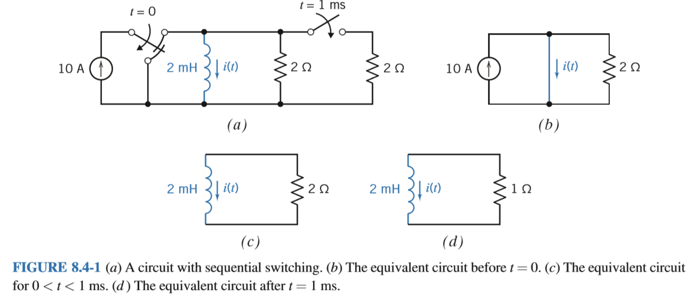
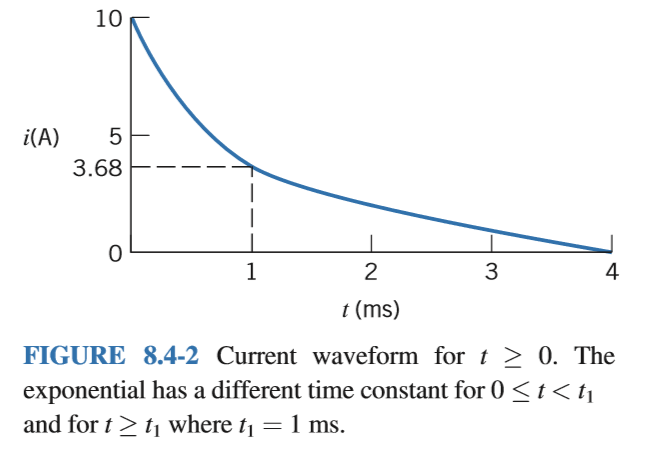

# Chapter 8 The Complete Response of RL and RC Circuit

## 8.1 Introduction

In this chapter, we consider the response of RL and RC circuits to abrupt changes. The abrupt change might be a change to the circuit, as when a switch opens or closes. Alternately, the abrupt change might be a change to the input to the circuit, as when the voltage of a voltage source is a discontinuous function of time.

RL and RC circuit are called first-order circuits. In this chapter, we will do the following:

*	Develop vocabulary that will help us talk about the response of a first-order circuit.
*	Analyze first-order circuits with inputs that are constant after some particular time, $t_0$.
*	Introduce the notion of a stable circuit and use it to identify stable first-order circuits.
*	Analyze first-order circuits that experience more than one abrupt change.
*	Introduce the step function and use it to determine the step response of a first-order circuit.
*	Analyze first-order circuits with inputs that are not constant.

## 8.2 First-Order Circuit

Circuits that contain capacitors and inductors can be represented by differential equations. The order of the differential equations is usually equal to the number of the capacitors plus the number of inductors in the circuit.

**Circuit that contain only one inductor and no capacitors or only one capacitor and no inductors can be represented by a first-order differential equation. These circuits are called first-order circuits.**

Thevenin and Norton equivalent circuits simplify the analysis of first-order circuits by showing that all first-order circuits are equivalent to one of two simple first-order circuits. Below shows how this is accomplished. A first-order circuit is partitioned into two parts. One part is the circuit--everything except that capacitor or inductor. If it is a capacitor, then the rest of the circuit is replaced by its Thevenin equivalent circuit. The result is a simple first-order circuit--a series circuit consisting of a voltage source, a resistor, and a capacitor. On the other hand, if the energy storage element is an inductor, then the rest of the circuit is replaced by its Norton equivalent circuit. The result is another simple first-order circuit--a parallel circuit consisting of a current source, a resistor, and an inductor. Indeed, all first-order circuits are equivalent to one of these two simple first-order circuits.

When the input to a circuit is sinusoidal, the steady-state response is also sinusoidal. Furthermore, the frequency of the response sinusoid must be the same as the frequency of the input sinusoid. The circuit shown above is at steady state before the switch is closed. The steady-state capacitor voltage will be

$$v(t) = B \cos(1000t + \psi), \quad t < 0 $$

The switch closes at time $t=0$. The value of the capacitor voltage at the time the switch closes is

$$v(0) = B \cos (\psi), \quad t =0 $$

After the switch closes, the response will consist of two parts: a transient part that eventually dies out and a steady-state part. The steady-state part of the response will be sinusoidal and will have the frequency of the input. For a first-order circuit, the transient part of the response is exponential. Indeed, we consider first-order circuits separately to take advantage of the simple form of the transient response of these circuits. After the switch is closed, the capacitor voltage is

$$v(t) = Ke^{-t/\tau} + M \cos (1000t + \delta)$$

Notice that $Ke^{-t/\tau}$ goes to zero at $t$ becomes large. This is the transient part of the response, which dies out, leaving the steady-state response, $M \cos(1000 t + \delta)$.

As a matter of vocabulary, the "transient part of the response" is frequently shortened to the **transient response**, and the "steady-state part of the response" is shortened to the "steady-state response". The response, $v(t)$, is called the **complete response** to the contrast in with the transient and steady-state responses.

**complete response = transient response + steady-state response**

>(The term transient response is used in two different ways by electrical engineers. Sometimes it refers to the “transient part of the complete response,” and at other times, it refers to a complete response, which includes a transient part. In particular, PSpice uses the term transient response to refer to the complete response. This can be confusing, so the term transient response must be used carefully.) 

In general, the complete response of a first-order circuit can be represented as the sum of two parts, the **natural response** and the **forced response**:

**complete response = natural response + forced response**

The natural response is the general solution of the differential equation representing the first-order circuit, when the input is set to zero. The forced response is a particular solution of the differential equation representing the circuit.

The complete response of a first-order circuit will depend on an initial condition, usually a capacitor voltage or an inductor current at a particular time. Let $t_0$ denote the time at which the initial condition is given. The natural response of a first-order circuit will be of the form

**$$ \text{natural response}  = Ke^{-(t-t_0)/\tau}$$**

When $t_0 = 0$, then

$$\text{natural response} = Ke^{-t/\tau}$$

The constant $K$ in the natural response depends on the initial condition, for example, the capacitor voltage at time $t_0$.

In this chapter, we will consider three cases. In these cases, the input to the circuit after the disturbance will be (1) a constant, for example,

$$v_s(t) = V_0$$

or (2) an exponential, for example,

$$v_s(t) = V_0e^{-t/\tau}$$

or (3) a sinusoid, for example,

$$v_s(t) = V_0 \cos (\omega t + \theta)$$

These three cases are special because the forced response will have the same form as the input. For example, in the above figure, both the forced response and input are sinusoidal, and the frequency of the forced response is the same as the frequency of the input. For another inputs, the forced response is not a square wave.

When the input is a constant or a sinusoid, the forced response is also called the steady-state response, and the natural response is called the transient response.

Here is out plan for finding the complete response of first-order circuits:

Step 1: Find the forced response before the disturbance. Evaluate this response at time $t = t_0$ to obtain the initial condition of the energy storage element.

Step 2: Find the forced response after the disturbance.

Step 3: Add the natural response $= Ke^{-t/\tau}$ to the forced response to get the complete response. Use the initial condition to evaluate the constant $K$.

## 8.3 The Response of a First-Order Circuit to a Constant Input

In this section, we find the complete response of a first-order circuit when the input to the circuit is constant after time $t_0$. Figure 8.3-1 illustrates this situation. In Figure 8.3-1a, we find a first-order circuit that contains a single capacitor and no inductors. This circuit is at steady state before the switch closes, disturbing the steady state. The time at which steady state is disturbed is denoted as $t_0$. In Figure 8.3-1a, $t_0 = 0$. Closing the switch removes the resistor $R_1$ from the circuit. (A closed switch is modeled by a short circuit. A short circuit in parallel with a resistor is equivalent to a short circuit.) After the switch closes, the circuit can be represented as shown in Figure 8.3-1b. In Figure 8.3-1b, the part of the circuit that is connected to the capacitor has been replaced by its Thevenin equivalent circuit. Therefore,

$$V_{oc} = \frac{R_3}{R_2 + R_3} V_s \text{ and } R_t = \frac{R_2 R_3}{R_2+ R_3}$$

Let's represent the circuit in Figure 8.3-1b by a differential equation. The capacitor current is given by

$$i(t) = C \frac{d}{dt} v(t)$$

The same current $i(t)$, passes through the resistor. Apply KVL to Figure 8.3-1b to get

$$V_{oc} = R_t i(t) + v(t) = R_t \left( C\frac{d}{dt} v(t) \right) +v(t)$$

Therefore,

$$\frac{d}{dt} v(t) + \frac{v(t)}{R_t C} = \frac{V_{oc}}{R_t C}$$

The highest-order derivative in this equation is first order, so this is a first-order differential equation.

Next, let's turn our attention to the circuit shown in Figure 8.3-2a. This circuit contains a single inductor and no capacitors. This circuit is at steady state before the switch closes at time $t_0=0$, disturbing the steady state. After the switch closes, the circuit can be represented as shown in Figure 8.3-2b. In Figure 8.3-2b, the part of the circuit that is connected to the inductor has been replaced by its Norton equivalent circuit. We calculate

$$I_{sc} = \frac{V_s}{R_2} \text{ and } R_t = \frac{R_2 R_3}{R_2 + R_3}$$

Let's represent the circuit in Figure 8.3-2b by a differential equation. The inductor voltage is given by

$$v(t) = L \frac{d}{dt} i(t)$$

The voltage $v(t)$ appears across the resistor. Apply KCL to the top node in Figure 8.3-2b to get

$$I_{sc} = \frac{v(t)}{R_t} + i(t)= \frac{L\frac{d}{dt}i(t)}{R_t} + i(t)$$

Therefore,

$$\frac{d}{dt} i(t) + \frac{R_t}{L}i(t) = \frac{R_t}{L}I_{sc}$$

As before, this is a first-order differential equation.

They have the same form. That is

$$\frac{d}{dt} x(t) = \frac{x{t}}{\tau} = K$$

The parameter $\tau$ is called the time constant. We will solve this differential equation by separating the variables and integrating.

We may rewrite as:

$$\frac{dx}{dt} = \frac{X\tau - x}{\tau}$$

or, separating the variables

$$ \frac{dx}{x-K\tau} = - \frac{dt}{\tau}$$

Forming the indefinite integral, we have

$$\int \frac{dx}{x-K\tau} = -\frac{1}{\tau} \int dt +D$$

where $D$ is a constant of integration. Performing the integration, we have

$$\ln (x - K\tau) = - \frac{t}{\tau} + D$$

Solving for $x$ gives

$$x(t) = K\tau + A e ^{-t/\tau}$$

where $A = e^D$, which is determined from the initial condition, $x(0)$. To find $A$, let $t=0$. Then

$$x(0) = K\tau + Ae^{-0/\tau} = K\tau + A$$

or

$$A = x(0) - K\tau$$

Therefore, we obtain

$$x(t) = K\tau + [x(0)-K\tau] e^{-t/\tau}$$

Because

$$x(\infty) = \lim_{t\rightarrow \infty} x(t) = K\tau$$

It can be written as

$$x(t) = x(\infty) + [x(0) - x(\infty)]e^{-t/\tau}$$

Taking the derivative of $x(t)$ with respect to $t$ leads to a procedure for measuring or calculating the time constant:

$$\frac{d}{dt}x(t) = - \frac 1\tau [x(0) - x(\infty)]e^{-t/\tau}$$

Noe let $t=0$ to get

$$\frac{d}{dt} x(t) \Big|_{t=0} = - \frac 1\tau [x(0)-x(\infty)]$$

or

$$\tau = \frac{x(\infty) - x(0)}{\frac{d}{dt}x(t) \Big|_{y=0}}$$

Figure 8.3-3 shows a plot of $x(t)$ versus $t$. We can determine the values of (1) the slope of the plot at time $t=0$, (2) the initial value of $x(t)$, and (3) the final value of $x(t)$ from this plot. The equation can be used to calculate the time constant from these values. Equivalently, Fiture 8.3-3 shows how to measure the time constant from a plot of $x(t)$ versus $t$.

Next, we apply these result to the RC circuit in Figure 8.3-1. Comparing the equations we see that

$$x(t) = v(t) \quad \tau = R_t C \quad K = \frac{V_{oc}}{R_t C}$$

Making these substitutions gives

$$v(t) = V_{oc} + (v(0)-V_{oc}) e^{-t/R_tC}$$

The second term on the right-hand side dies out as $t$ increases. This is the transient or natural response. At $t=0$, $e^{-0}=1$. Letting $t=0$ gives $v(0)=v(0)$ as required. When $t=5\tau$, $e^{-5} = 0.0067 \approx 0$, so that time $t=5\tau$, the capacitor voltage will be

$$v(5\tau) = 0.9933 V_{oc} + 0.0067v(0) \approx V_{oc}$$

This is the steady-state or forced response. The forced response is of the same form, a constant, as the input to the circuit. The sum of the natural and forced responses is the complete response:

$$\text{complete response } = v(t), \quad \text{forced response } = V_{oc}$$

and

$$\text{natural response } = (v(0)- V_{oc}) e^{-t/R_tC}$$

Next, comparing the equation finds the solution of the RL circuit in Figure 8.3-2. We see that

$$x(t) = i(t) \quad \tau=\frac{L}{R_t} \quad K = \frac{L}{R_t} I_{sc}$$

Making these substitution gives

$$i(t) = I_{sc} + (i(0)-I_{sc})e^{-(R_t/L)t}$$

Again, the complete response is the sum of the forced (steady-state) response and the transient (natural) response:

$$\text{complete response } = i(t) \quad \text{forced response } = I_{sc}$$

and

$$\text{natural response } = (i(0)-I_{sc})e^{-(R_t/L)t}$$

## 8.4 Sequential Switching

Often, circuits contain several switches that are not switched at the same time. For example, a circuit may have two switches where the first changes state at time $t=0$ and the second switch closes at $t=1$ ms.

**Sequential switching occurs when a circuit contains two or more switches that change state at different instants.**

Circuits with sequential switching can be solved using the methods described in the previous sections, based on the fact that inductor currents and capacitor voltages do not change instantaneously.

As an example of sequential switching, consider the circuit shown in Figure 8.4-1a. This circuit contains two switches--one that changes state at time $t=0$ and a second that closes at $t=1$ ms. Suppose this circuit has reached steady state before the switch changes state at time $t=0$. Figure 8.4-1b shows the equivalent circuit that is appropriate for $t<0$. Because the circuit is at steady state and the input is constant, the inductor acts like a short circuit and the current in this short circuit is the inductor current. The short circuit forces the voltage across the resistor to be zero, so the current in the resistor is also zero. As a result, all of the source current flows in the short circuit and

$$i(t) = 10 A \quad t<0$$

The inductor current will be 10 A immediately before the switch changes state at time $t=0$. We express this as

$$i(0^-) = 10 A$$

Because the inductor current does not change instantaneously, the inductor current will also be 10 A immediately after the switch changes state. That is,

$$i(0^+) = 10 A$$

This is the initial condition that is used to calculate the inductor current after $t=0$. Figure 8.4-1c shows the equivalent circuit that is appropriate after one switch changes state at time $t=0$ and before the other switch closes at time $t=1$ ms. We see that Norton equivalent of the part of the circuit connected to the inductor has the parameters

$$I_{sc} = 0 A \quad R_t = 2 \Omega$$

The time constant of this first-order circuit is

$$\tau = \frac{L}{R_t} = \frac{2\times 10 ^{-3}}{2} = 1 \times 10 ^{-3} \text{ ms}$$

The inductor current is

$$i(t) = i(0)e^{-t/\tau} = 10 e^{-t} A$$

for $0<t<1$ ms. Notice that $t$ has units of ms. Immediately before the other switch closes at time $t=1$ ms, the inductor current will be

$$i(1 ^-)= 10e^{-1} = 3.68 A$$

Because the inductor current does not change instantaneously, the inductor current will also be 3.68 A immediately after the switch changes state. That is

$$i(1^+) = 3.68 A$$

This is the initial condition that is used to calculate the inductor current after the switch closes at time $t=1$ ms. Figure 8.4-1d shows the appropriate equivalent circuit. We see that the Norton equivalent of the part of the circuit connected to the inductor has the parameters

$$I_{sc} = 0 A \quad R_t = 1 \Omega$$

The time constant of the first-order circuit is

$$\tau = \frac{L}{R_t} = 2 \text{ ms}$$

The inductor current is

$$i(t) = i(t_0) e^{-(t-t_0)/\tau} = 3.68e^{-(t-1)/2} A$$

for 1 ms $<t$. Once again, $t$ has unit of ms. Also, $t_0$ denotes the time when the switch changes state--1 ms in this example.

Figure 8.4-2 shows a plot of the inductor current. The time constant changes when the second switch closes. As a result, the slope of the plot changes that $t=1$ ms. Immediately before the switch closes, the slope is $-3.68$ A/ms. Immediately after the switch closes, the slope becomes $-3.68/2$ A/ms.

