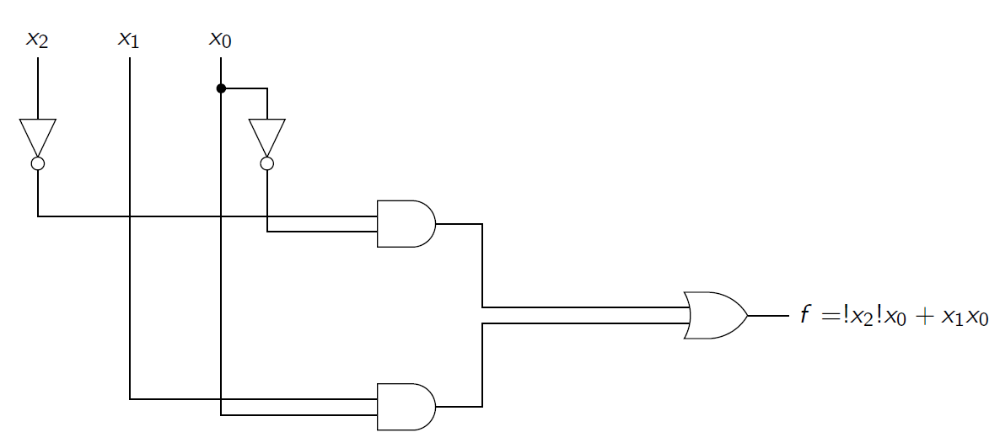

# Truth Table

## Binary Variables and Functions

* A binary variable is a variable that take on only two discrete values 0 and 1.
* A binary logic function produces an output as an expression of its inputs. Its inputs are binary variables and/or other binary logic functions. A binary logic function evaluates to either 0 or 1 depending on the value of its inputs.

## Truth Tables

* A truth table is one way to express a logic function in a tabular form.
* Specifies the value (output) of the logic function for each possible setting of inputs -> one row for each input combination.
* Row of the truth table are typically arranged in an "ordered" fashion
* Example

| $x_0$ | $x_1$ | $x_2$| $f$ |
|---|---|---|---|
| 0 | 0 | 0 | 1 |
| 0 | 0 | 1 | 0 |
| 0 | 1 | 0 | 1 |
| 0 | 1 | 0 | 1 |
| ... | | |

* Can refer to rows of the truth table as "row 0" "row 1" etc.

## Logic Functions

* Can also write a logic equation as an expression
* Example $f=\bar{x_2}\bar{x_1}\bar{x_0}+\bar{x_2}x_1\bar{x_0}+x_2x_1x_0$
* The logic expression provides the same information as the truth table.
* To manipulate or evaluate logic expression, we need to define some logic operations.

## Logic Operators

* Three basic logic operations: `AND` `OR` and `NOT`
* Basic logic operations have symbols

| Operation | Symbol |
|---|---|
| `AND` | $\cdot$, "nothing" |
| `OR` | $+$ |
| `NOT` | $!$, $'$, $\lnot$ $\bar{}$ |

* The behavior of each operation is defined via a truth table.
* Operators also have precedence: parentheses `()` then `NOT` then `AND` then `OR`
* The purpose of parentheses is to clarify precedence

## Logic Operators -- `AND`

* Generates an output of 1 when all inputs are 1, otherwise 0.

| $x_0$ | $x_1$ | $f = x_1x_0$ |
|---|---|---|
| 0 | 0 | 0 |
| 0 | 1 | 0 |
| 1 | 0 | 0 |
| 1 | 1 | 1 |

## Logic Operators -- `OR`

* Generates an output of 1 when any input is 1, otherwise 0.

| $x_0$ | $x_1$ | $f=x_1+x_0$ |
|---|---|---|
| 0 | 0 | 0 |
| 0 | 1 | 1 |
| 1 | 0 | 1 |
| 1 | 1 | 1 |

## Logic Operators -- `NOT`

Take only a single input and flips (inverts, complements) the input value

| $x$ | $f=!x$ |
|---|---|
| 0 | 1 |
| 1 | 0 |

## Truth Table from Logic Expression

Given a logic function $f$, can find its truth table by evaluating $f$ for every possible input combination.

## Schematic symbols for logic operators

## Circuit diagrams

* The circuit diagram (schematic) can be seen as a third way to represent a logic function.
* Clearly, giving a circuit diagram, we can write down the corresponding logic function.