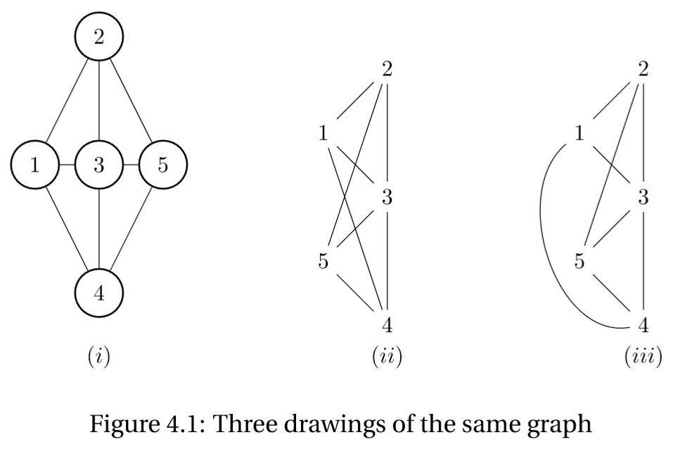
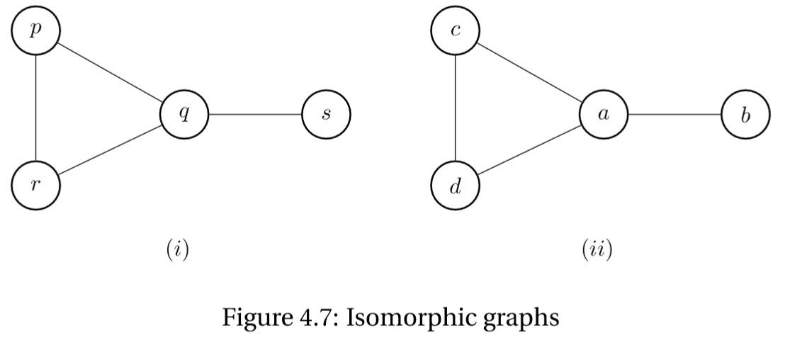
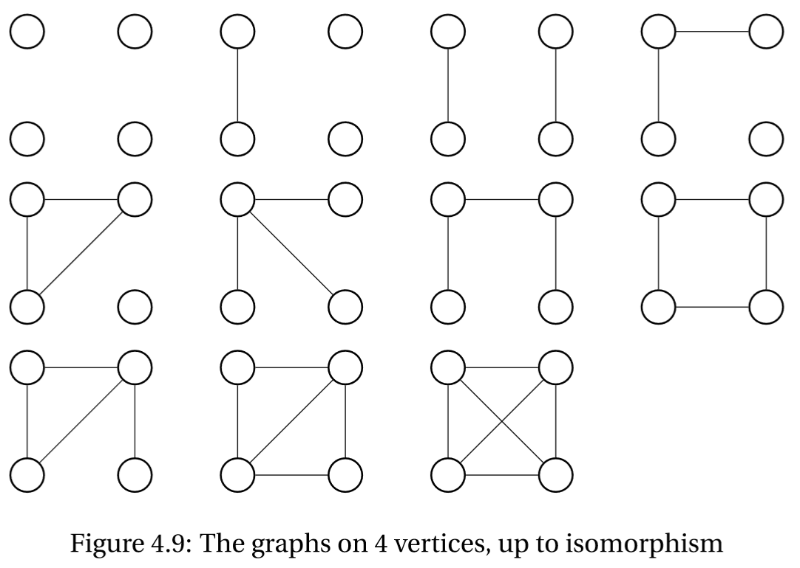
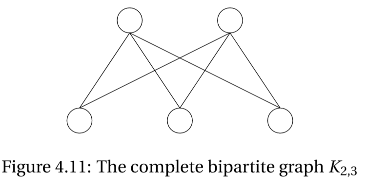
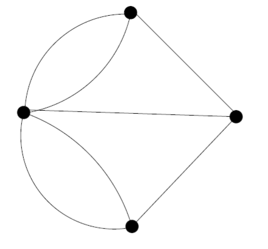

# Chapter 4 Introduction to Graph Theory

## 4.1 Definitions

Graph theory is the study of mathematical objects known as "graphs"--a word to which graph theorists have given a rather special meaning. So we must start be defining exactly what a graph is.

#### 4.1.1 Definition

A **Graph** $G$ is a finite nonempty set, $V(G)$, of objects, called **vertices**, together with a set, $E(G)$, of unordered pairs of distinct vertices. The element of $E(G)$ are called edges.

For example, we might have

$$V(G) = \\{1,2,3,4,5\\}$$

and

$$E(G) = \\{\\{1,2\\},\\{1,3\\},\\{1,4\\},\\{2,3\\},\\{2,5\\},\\{3,4\\},\\{3,5\\},\\{4,5\\}\\}$$

For the sorts of results with which we are concerned, it is most convenient to consider the following geometric representation or diagram or **drawing** of a graph. On the page we draw a small circle to correspond to each vertex. For each edge we then draw a line between the corresponding pair of vertices. The only restriction on such a line is that it does not intersect the circle corresponding to any other vertex. For example, the above graph is represented in Figure 4.1 in three different ways.

If $e = \\{u,v\\}$ then we say that $u$ and $v$ are **adjacent** vertices, and that edge $e$ is **incident** with vertices $u$ and $v$. We can also say that the edge $e$ **joins** $u$ and $v$.

Vertices adjacent to a vertex $u$ are called **neighbors** of $u$. The set of neighbors of $u$ is denoted $N(u)$. A graph is completely specified by the pairs of vertices that are adjacent, and the only function of a line in the drawing, representing and edge, is to indicate that two vertices are adjacent. In (i) of Figure 4.1, no edge crosses another; in (ii) of Figure 4.1, the edge $\\{1,4\\}$ crosses edges $(2,5)$ and $(3,5)$. A graph which can be represented with no edges crossing is said to be **planar**, so our graph $G$ is planar by Figure 4.1 (i).

Some important points arise from our definition of a graph.

1.	Edges are **unordered** pairs of vertices. Thus the edge $(v_1, v_2)$ is not from $v_1$ to $v_2$ or vice versa; it is imply "between" $v_1$ and $v_2$. If we change Definition 4.1.1 to read "ordered pairs" we obtain the definition of a different kind of graph, a **directed graph** or **digraph**.
2.	$E(G)$, being a set, either contain a pair $(v_1,v_2)$ or it does not. Thus we do not allow the possibility of "multiple edges".
3.	The edges are pairs of **distinct** vertices. Hence we cannot have a loop, i.e., an edge joining a vertex to itself. Nevertheless in some circumstances it can be convenient to consider loops and/or multiple edges. If we wish to allow loops and multiple edges we will use the term **multigraph** instead of graph.
4.	Note that $V(G)$, and hence $E(G)$, is a **finite** set. If we remove this condition we find ourselves in the realm of infinite graphs--and that is a whole new ballgame.

## 4.2 Isomorphism

Figure 4.7(i) is the diagram of the graph $G$, where

$$V(G)=\\{p,q,r,s\\} \quad E(G)=\\{\\{p,q\\},\\{p,r\\},\\{q,r\\},\\{q,s\\}\\}$$

Figure 4.7(ii) is the diagram of the graph $H$, where

$$V(G)=\\{a,b,c,d\\} \quad E(G)=\\{\\{a,b\\},\\{a,c\\},\\{a,d\\},\\{c,d\\}\\}$$

The graphs $G$ and $H$ are not the same--$G$ has vertices $p,q,r,s$ and $H$ has vertices $a,b,c,d$--but for almost all purpose they are indistinguishable. We make this idea precise.

#### 4.2.1 Definition

Two Graphs $G_1$ and $G_2$ are **isomorphic** is there exists a bijection $f:V(G_1) \rightarrow V(G_2)$ such that vertices $f(u)$ and $f(v)$ are adjacent in $G_2$ if and only if $u$ and $v$ are adjacent in $G_1$. (We might say that $f$ preserves adjacency.)

The bijection $f$ in this definition that preserves adjacency is called an **isomorphism**. For example, an isomorphism from $G$ and $H$ is $g$, defined by

$$g(p)=c \quad g(q)=a \quad g(r)=d \quad g(s)=b$$

Another isomorphism is $h$, defined by

$$h(p)=d \quad h(q)=a \quad h(r)=c \quad h(s)=b$$

Figure 4.8 shows two other graphs, $G$ and $H$, that are isomorphic. One isomorphism is the mapping $f:V(G) \rightarrow V(H)$ given by

$$f (1)=a \quad f (2)=b \quad f (3)=c \quad f (4)=h \quad f (5)=i \quad f (6)=j \quad f (7)=d \quad f (8)=e \quad f (9)=f \quad f (10)=g$$

(This graph is called the **Petersen graph**)

The collection of graphs that are isomorphic to $G$ forms the **isomorphism class** of $G$. In almost all cases, a graph has some property if and only if all graphs in its isomorphism class have the property. Thus we generally regard isomorphic graphs as the "same" even if formally they might not be equal. Even if $G$ has only one vertex, there are infinitely many graphs in its isomorphism class. Fortunately though, the number of isomorphism classes of graphs with a given finite set of vertices is finite. For example, there are exactly 11 isomorphism classes of graphs on 4 vertices, pictured in Figure 4.9. Note that in this figure, the vertices of the graphs are not given explicitly, because however we assign vertices to the drawing, we will still get a graph in the same isomorphism class. 

The identity map on $V(G)$ is an isomorphism form the graph $G$ to itself. An isomorphism from $G$ to itself is called an **automorphism** of $G$.

## 4.3 Degree

The number of edges incident with a vertex $v$ is called the **degree** of $v$, and is denoted by $deg(v)$. For example in G of Figure 4.7 we have $deg(p) = deg(r) = 2$ $deg(q) =3$ $deg(s)=1$; in G of Figure 4.8, all vertices have degree 3. In what follows we generally use $p$ for the number of vertices and $q$ for the number of edges.

#### 4.3.1 Theorem

For any graph $G$ we have

$$\sum_{v \in V(G)} deg(v) = 2 |E(G)|$$

>#### Proof
Each edge has two ends, and when we sum the degrees of the vertices, we are counting the edges twice, once for each end.
$\square$

This is known as the **Handshaking Lemma** or the **Degree-Sum Formula**.

#### 4.3.2 Corollary

The number of vertices of odd degree in a graph is even.

>#### Proof
The sum of all degrees is $2q$, an even number. The sum of the vertices of even degree is even. Hence the sum of the vertices of add degrees is also an even number. This implies that there must be an even number of vertices with odd degree.
$\square$

#### 4.3.3 Corollary

The average degree of a vertex in the graph G is

$$\frac{2 |E(G)|}{|V(G)|}$$

A graph in which every vertex has degree $k$, for some fixed $k$, is called a $k$-**regular** graph (or just a **regular** graph). We note one important class of regular graphs.

#### 4.3.4 Definition

A **complete graph** is one in which all pairs of distinct vertices are adjacent. (Thus each vertex is joined to every other vertex.) The complete graph with $p$ vertices is denoted by $K_p$, $p\geq 1$.

In $K_n$ each vertex is adjacent to $n-1$ vertices distinct from it, thus $K_n$ is regular with degree $n-1$. The number of edges in $K_n$ is therefore ${n \choose 2}$, following Corollary 4.3.2.

## 4.4 Bipartite Graphs

A graph in which the vertices can be partitioned into two sets $A$ and $B$, so that all edges join a vertex in $A$ to a vertex in $B$, is called a **bipartite** graph, with **bipartition** $(A,B)$. The **complete** bipartite graph $K_{m,n}$ has all vertices in $A$ adjacent to all vertices in $B$, with $|A| = m, |B| = n$. For example, Figure 4.11 is a drawing of $K_{2,3}$.

#### 4.4.1 Definition

For $n\geq 0$, the $n$-**cube** is the graph whose vertices are the $\\{0,1\\}$-strings of length $n$, and two strings are adjacent if and only if they differ in exactly one position.

## 4.6 Paths and Cycles

A subgraph of a graph $G$ is a part of $G$ (or possibly the whole of G). More rigorously we have

#### 4.6.1 Definition

A **subgraph** of a graph $G$ is a graph whose vertex set is subset $U$ of $V(G)$ and whose edge set is a subset of those edges of $G$ that have both vertices in $U$.

Thus if $H$ is a subgraph of $G$, then $H$ has some (perhaps all) the vertices of $G$ and some (perhaps all) the edges that, in $G$, join vertices of $H$. (Clearly we cannot have any edges in $H$ that involves vertices not in $H$.) If $V(H) = V(G)$, that is $H$ has all vertices of $G$, we say $H$ is a **spanning subgraph** of $G$

If $H$ is a subgraph of $G$ and $H$ is not equal to $G$, we say it is a **proper subgraph** of $G$. If $D$ is a subgraph of $G$ and $C$ is a subgraph of $D$, then $C$ is a subgraph of $G$.

A **walk** in a graph $G$ from $v_0$ to $v_n$, $n \geq 0$, is an alternating sequence of vertices and edges of $G$

$$v_0e_1...v_{n-1}e_nv_n$$

which begins with vertex $v_0$, ends with vertex $v_n$ and, for $1 \leq i \leq n$, edge $e_i = \\{v_{i-1}, v_i\\}$. Such a walk can also be called a $v_0 v_n$-**walk**. Note that the **length** of a walk is the number of edges in it (in this case, $n$). Also, because we can reverse a walk to get a walk from $v_n$ to $v_0$, we refer, where convenient, to a walk **between** a pair of vertices, instead of from one to the other. A walk is said to be **closed** if $v_0 = v_n$.

A **path** is a walk in which all the vertices are distinct. A path that starts at $v_0$ and ends at $v_n$ is called a $v_0 v_n$-**path**. Observe that since all the vertices in a path are distinct, so are all the edges.

Since graphs have no multiple edges, consecutive vertices $v_{i-1}$ and $v_i$ determine the edges $e_i$ of a walk. Hence, in describing a walk we often omit the edges.

#### 4.6.2 Theorem

If there is a walk from vertex $x$ to vertex $y$ in $G$, then there is a path from $x$ to $y$ in $G$.

>#### Proof
We use a form of proof by  contradiction.
Suppose that $v_0,...,v_n$ is a walk in $G$ from $v_0 = x$ and $v_n = y$ with minimal length (along all walks from $x$ to $y$). If the walk is not a path, then $v_i = v_j$ for some $i<j$, and then $v_0,...,v_i,v_{j+1},...,v_n$ would be a walk from $x$ to $y$ whose length is less than the minimum possible. But this contradicts our initial choice, and so we conclude that the vertices in our original walk are all distinct, and therefore it is a path.
$\square$

#### 4.6.33 Corollary

Let $x$, $y$, $z$ be vertices of $G$. If there is a path from $x$ to $y$ in $G$ and a path from $y$ to $z$ in $G$, then there is a path from $x$ to $z$ in $G$.

>#### Proof
The path from $x$ to $y$ followed by the path from $y$ to $z$ is a walk from $x$ to $z$ in $G$, so by Theorem 4.6.2, there is a path from $x$ to $z$ in $G$.
$\square$

A **cycle** in a graph $G$ is a subgraph with $n$ distinct vertices $v_0,...,v_{n-1}$, $n\geq 1$ and $n$ distinct edges $\\{v_0,v_1\\},\\{v_1,v_2\\},...,\\{v_{n-2},v_{n-1}\\},\\{v_{n-1},v_0\\}$. Equivalently, a cycle is a connected graph that is regular of degree two.

The subgraph we get from a cycle by deleting one edge is called a **path**. This is inconsistent with the original definition of path, because we defined a path to be a type of walk, and a walk is a sequence of vertices and edges and so is not a graph. But it is very convenient to use the word path in both senses, and we will.

A cycle with $n$ edges is called an $n$-cycle or a cycle of length $n$. A cycle of length 1 has one vertex, $v_0$ and one edge $v_0 v_0$ which is a loop. Therefore since graphs have no loops, a graph has no cycle of length one. A cycle of length 2 has two vertices $v_0$ and $v_1$, and two distinct edges, called multiple edges, joining $v_0$ and $v_1$. Therefore, a graph has no cycle of length two. Thus the shortest possible cycle in a graph is a 3-cycle, often called a triangle.

Note that for a cycle with $n \geq 3$ vertices $v_0,...,v_{n-1}$ then $v_i v_{i+1} ... v_{n-1}v_0,...,v_i$ and $v_iv_{i-1}...v_0v_{n-1}...v_i$ are both closed walks for each $i = 0,...,n-1$, and in this way there are $2n$ closed walks of length $n$ associated with a given $n$-cycle.

In a cycle, every vertex has degree exactly 2. There's one condition that guarantees that a graph contains a cycle.

#### 4.6.4 Theorem

If every vertex in $G$ has degree at least 2, then $G$ contains a cycle.

>#### Proof
Let $v_0v_1,...,v_k$ be a longest path in $G$. The vertex $v_0$ has $v_1$ as one neighbor, Since $v_0$ has degree at least 2, $v_0$ has another neighbor $x$. If $x4$ is not on the path, then it is a path longer than our longest path, which is a contradiction. Hence $x$ must be on the path, and $x=v_i$ for some $i \geq 2$.
$\square$

A spanning cycle in a graph is known as a **Hamilton** cycle. Although it is easy to decide if a given cycle is a Hamilton cycle, it can be surprisingly difficult to find one in a graph or to certify that is has no HAmilton cycle.

## 4.8 Connectedness

#### 4.8.1 Definition

A graph $G$ is **connected** if, for each two vertices $x$ and $y$, there is a path from $x$ to $y$.

#### 4.8.2 Theorem

Let $G$ be a graph and let $v$ be a vertex in $G$. If for each vertex $w$ in $G$ there is a path from $v$ to $w$ in $G$, then $G$ is connected.

>#### Proof
For any vertices $x$ and $y$ in $G$, there is a path from $v$ to $x$ and a path from $v$ to $y$. If we reverse the path from $v$ to $x$ we obtain a path from $x$ to $v$, and now Corollary 4.6.3 implies that there is a path from $x$ to $y$ in $G$, so $G$ is connected by Definition 4.8.1.
$\square$

If $G$ is a graph on $n$ vertices, then to certify that $G$ is connected according to the definition of connected, we must provide a total of ${n \choose 2}$ paths. The above theorem reduces the workload: only $n$ path are needed.

#### 4.8.4 Definition

A **component** of $G$ is subgraph $C$ of $G$ such that

1.	$C$ is connected.
2.	No subgraph of $G$ that properly contains $C$ is connected.

These two conditions may sometimes be stated in the form "a component of $G$ is a subgraph which is maximal, subject to be connected". Here when we say a subgraph $C$ of $G$ is maximal, subject to having some property, then this means that any subgraph that properly contains $C$ does not have this property.

Note that we could have defined a component of $G$ to be the equivalence class of a vertex, relative to the relation "is joined by a walk to". Since this is indeed an equivalence relation, it follows immediately that the components of $G$ partition its vertex set.

Figure 4.21 shows a graph having three components. Note that there are paths between every pair of vertices in the same component, but not between pairs of vertices in different components. 

While it is easy to convince someone of the existence of a path between two vertices (show them the path), it is less clear how you might convince them that a path does not exist. We introduce a convenient way of doing this.

If we are given a partition $(X,Y)$ of $V(G)$ such that there are no edges having an end in $X$ and an end in $Y$, then there is no path from any vertex in $X$ to any vertex in $Y$. So, if $X$ and $Y$ are both nonempty, $G$ is not connected. Given a subset $X$ of the vertices of $G$, the **cut** induced by $X$ is the set of edges that have exactly one end in $X$.

#### 4.8.5 Theorem

A graph $G$ is not connected if and only if there exists a proper nonempty subset $X$ of $V(G)$ such that the cut induced by $X$ is empty.

>#### Proof
Let $G$ be a connected graph, and let $X$ be a proper nonempty subset of $V(G)$. Choose $u\in X$ and $v \in V(G) \setminus X$. Since $G$ is connected, there exists a path $x_0,...,x_n$ from $u$ to $v$. Choose $k$ as large as possible such that $x_k\in X$. Since $x_n = v \notin X, k < N$, the edge $x_k x_{k+1}$ is in the cut induced by $X$ and hence this cut is not empty.
Conversely, suppose that $G$ is not connected and let $C$ be a component of $G$. Consider the partition $(X,Y)$ of $V(G)$ where $X = V(C)$ and $Y= V(G) \setminus V(C)$. Since $C$ is connected and $G$ is not, $X$ is a proper non-empty subset of $V(G)$. Since $C$ is a component, if the vertex $y$ is adjacent to a vertex in $C$, then $y \in V(C)$. Hence the cut induced by $X$ is empty.
$\square$

## 4.9 Eulerian Circuits

One of the earliest problems in graph theory is the **seven bridges of Konigsberg** problem. In the 18th century in the town of Konigsberg (now Kaliningard, Russia), there were 7 bridges that crossed the river Pergel, which cuts through the city and there were 2 islands in the middle of the river. The layout can be roughly represented in the following diagram.

The question is that can a resident of the city leave home, cross every bridge exactly once, and then return home? We can formulate the layout of the city as a graph: Create 4 vertices representing the land areas (two shores and two islands), and create an edge for each bridge, joining the vertices representing the two land areas on either side of the bridge. In this case, we obtain the following graph (with multiple edges):

In terms of graph theory, the question becomes "is there a closed walk that uses every edge exactly once?" We use a definition for this type of walk.

#### 4.9.1 Definition

An Eulerian circuit of a graph $G$ is a closed walk that contains every edge of $G$ exactly once.

In 1736, Swiss mathematician Leonhard Euler noted that there cannot be an Eulerian circuit for the 7 bridge of Konigsberg problem. The reason being that if an Eulerian circuit exists, each time we visit a vertex, we must use 2 distinct edges incident with that vertex: use one edge to go the vertex, use one edge to leave the vertex. So every vertex must have even degree. However, in this graph, every vertex has odd degree, so such walk is not possible.

On the other hand, suppose we have a connected graph and every vertex has even degree. Does it have an Eulerian circuit? Euler noted that this is indeed true, and we give a proof here.

#### 4.9.2 Theorem

Let $G$ be a connected graph. Then $G$ has an Eulerian circuit if and only if every vertex has even degree.

>#### Proof
($\Rightarrow$) A closed walk contributes 2 to the degree of a vertex for each visit. Since an Eulerian circuit uses each edge of the graph exactly once, each vertex in the graph must have even degree.
($\Leftarrow$) We will prove by strong induction on the number of edges $m$ in $G$.
Base Case: if $G$ has 0 edges, then $G$ consists of exactly one isolated vertex. It has a trivial closed walk as an Eulerian circuit.
Induction Hypothesis: Assume that for some $m \geq 1$, any connected graph with less than $m$ edges where every vertex has even degree has an Eulerian circuit.
Inductive Step: Let $G$ be a connected graph with $m$ edges where every vertex has even degree. This implies that every vertex has degree at least 2. Therefore, by Theorem 4.6.4, there exists a cycle $C$ in $G$, say the vertex on the cycle in order are $v_1,...,v_k,v_1$.
Remove edges of $C$ from $G$ and remove isolated vertices to obtain $G'$. Since every vertex is incident with either 0 or 2 edges in $C$, every vertex in $G'$ still has even degree. Now $G'$ consists of components $C_1,...,C_l$ each containing less than $m$ edges.
By induction hypothesis, each component $C_i$ has an Eulerian circuit $W_i$. Moreover, each component must have a common vertex with $C$, for otherwise $G$ is disconnected. Let $v_{a_i}$ be one vertex of $C_i$. Rearrange the components so that $a_1 < a_2 < ... <a_l$ and let $W_i$ start and end at $v_{a_i}$.
Then we can construct an Eulerian circuit for $G$ by walking along $C$ and making detours $W_i$ as we hit $v_{a_i}$:
$$v_1,...,v_{a_1-1},W_1,v_{a_1+1},...,v_{a_2-1},W_2,v_{a_2+1},...,v_{a_l-1},W_l,v_{a_l+1},...,v_k,v_1$$
$\square$

## 4.10 Bridges

If $e \in E(G)$, we denote by $G-e$ (or by $G\setminus e$) the graph whose vertex set is $V(G)$ and whose edge set is $E(G) \setminus \\{e\\}$. (So $G-e$ is the graph contained from $G$ by deleting the edge $e$).

#### 4.10.1 Definition

An edge $e$ of $G$ is a **bridge** if $G-e$ has more components than $G$.

Thus if $G$ is connected, a bridge is an edge such that $G-e$ is not connected. Figure 4.22 shows a connected graph with a bridge $e$. Some texts, and some instructors, use **cut-edge** as a synonym for bridge.

#### 4.10.2 Lemma

If $e = (x,y)$ is a bridge of a connected graph $G$, the $G-e$ has precisely two components; furthermore, $x$ and $y$ are in different components.

>#### Proof
Let $e = (x,y)$. If $e$ is a bridge, then $G-e$ has at least two components. Let $V_x$ be the set of vertices in the same component of $G-e$ as $x$. Let $z$ be any vertex of $G-e$ not in $V_x$. Because there exists a path from $x$ to $z$ in $G$ but not in $G-e$, every path from $x$ to $z$ in $G$ contains edge $e$ and so must be of the form
$$xeye_2v_2e_3v_3...v_{n-1}e_nz$$
But $ye_2v_2...e_nz$ is a path from $y$ to $z$ in $G-e$. Thus $z$ is in the same component of $G-e$ as $y$, for every vertex $z$ not in $V_x$. Hence $G-e$ has 2 components, one containing vertex $x$ and the other containing vertex $y$.
$\square$

#### 4.10.3 Theorem

An edge $e$ is a bridge of a graph $G$ if and only if it is not contained in any cycle of $G$.

>#### Proof
We begin by proving the following implication: if edge $e= xy$ is an edge of some cycle of $G$, then $e$ is not a bridge of $G$.
By hypothesis, there is a cycle
$$xe_1v_1,...,v_{n-1}e_nyex$$
in G, then
$$xe_1v_1,...,v_{n-1}e_ny$$
is a path from $x$ to $y$ in $G-e$. Hence $e$ is not a bridge of $G$ by Lemma 4.10.2. This establishes the implication.

>To complete the proof, we must establish the converse--if edge $e$ is not a bridge of graph $G$, then $e$ is an edge of some cycle. Suppose $e =uv$ is not a bridge. Then $u$ and $v$ must lie in the same component of $G-e$ and so there is a path $P$ that joins them. Together with $e$ this path forms a cycle that contains $e$.
$\square$

#### 4.10.4 Corollar

If there are two distinct paths from vertex $u$ to vertex $v$ in $G$, then $G$ contains a cycle.

>#### Proof
Let $P_1$ and $P_2$ be distinct paths from $u$ and $v$. Suppose that $P_1$ is given by $x_0,...,x_n$ and $P_2$ is given by $y_0,...,y_m$. Thus $u = x_0 = y_0$ and $v=x_n=y_m$. Let $i$ be the first index such that $x_{i+1} \neq y_{i+1}$. Then $e = x_i, x_{i+1}$ is an edge in $P_1$ but not in $P_2$.
Consider the walk
$$x_i,x_{i-1},...,x_0 = u = y_0,...,y_m = v = x_n,x_{n-1},...,x_{i+1}$$
It is a walk from $x_i$ to $x_{i+1}$ that does not use the edge $e$. So it is also a walk in $G-e$, hence $x_i,x_{i+1}$ are in the same component in $G-e$. By Lemma 4.10.2 $e$ is not a bridge. By Theorem 4.10.3, $e$ must be part of a cycle. Hence $G$ contains a cycle.
$\square$

We will often use the contrapositive form of this result: If graph $G$ has no cycles, then each pair of vertices is joined by at most one path.