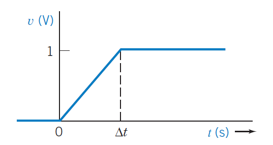
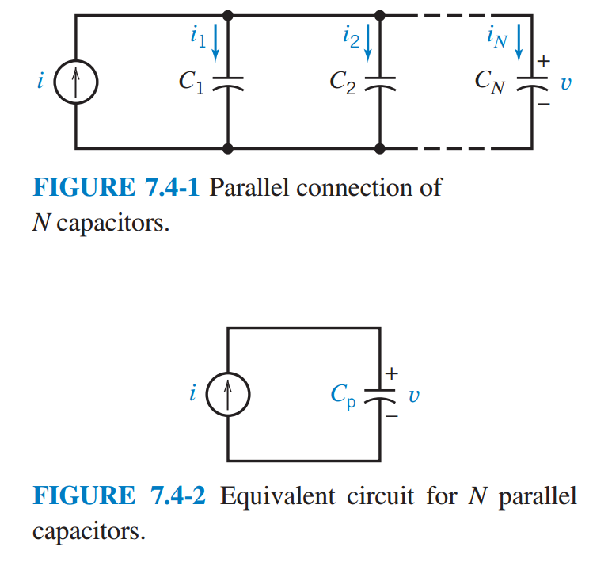
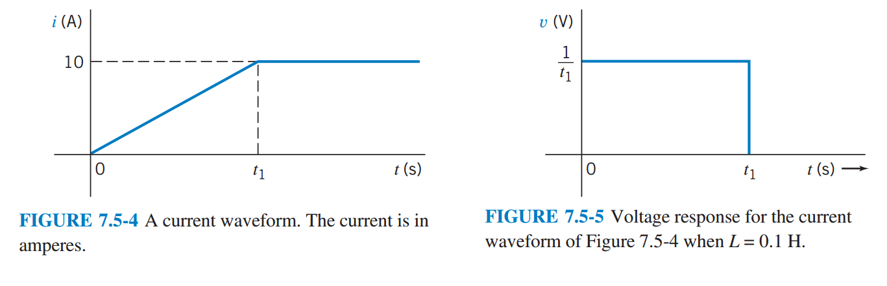

# Chapter 7: Energy Storage Elements

## 7.1 Introduction

This chapter introduces two more circuit elements, the capacitor and the inductor. The constitutive equation for the devices involve either integration or differentiation. Consequently:

*	Electric circuit that contain capacitors and/or inductors are represented by differential equations. Circuit that do not contain capacitors or inductors are represented by algebraic equations. We say that circuits containing capacitors and/or inductors are **dynamic** circuits, whereas circuits that do not contain capacitors or inductors are **static** circuits.
*	Circuits that contain capacitors and/or inductors are able to store energy.
*	Circuits that contain capacitors and/or inductors have memory. The voltage and currents at a particular time depend not only other voltages at currents at that same instant of time but also on previous values of those currents and voltages.

In addition, we will see that:

*	In the absence of unbounded currents or voltages, capacitor voltages and inductor currents are continuous functions of time.
*	In a DC circuit, capacitors act like open circuits and inductor act like short circuits.
*	Series or parallel capacitors can be reduced to an equivalent capacitor. Series or parallel inductors can be reduced to an equivalent inductor. Doing so does not change the element current or voltage of any other circuit element.
*	An op amp and a capacitor can be used to make circuits that perform the mathematical operations of integration or differentiation. Appropriately, these important circuits are called the integrator and the differentiator.
*	The element voltages and currents in a circuit containing capacitors and inductors can be complicated functions of time.

## 7.2 Capacitors

A capacitor is a circuit element that stores energy in an electric field. A capacitor can be constructed using two parallel conducting plates separated by distance $d$ as shown. 



Electric charge is stored on the plates, and uniform electric field exist between the conducting plates whenever there is a voltage across the capacitor. The space between the plates if filled with a dielectric material. Some capacitors use impregnated paper for a dielectric, whereas others use mica sheets, ceramics, metal films, or just air. A property of the dielectric material, called the dielectric constant, describes the relationship between the electric field strength and the capacitor voltage. Capacitor are represented by a parameter called the **capacitance**. The capacitance of a capacitor is proportional to the dielectric constant and the surface area of the plates and is inversely proportional to the distance between the plates. In other words, the capacitance $C$ of a capacitor is given by

$$C=\frac{\epsilon A}{d}$$

where $\epsilon$ is the dielectric constant, $A$ the area of the plates, and $d$ and distance between the plates. The unit of capacitance is coulomb per volt and is call farad (F) in honor of Michael Faraday.

A capacitor voltage $v(t)$ deposits a charge $+q(t)$ on one plate and a charge $-q(t)$ on the other plate. We say that the charge $q(t)$ is stored by the capacitor. The charge stored by a capacitor is proportional to the capacitor voltage $v(t)$. Thus we write

$$q(t) = C v(t)$$

where the constant of proportionality $C$ is the capacitance of the capacitor.

**Capacitance is the measure of the ability of a device to store energy in the form of a separated charge or an electric field.**

In general, the capacitor voltage $v(t)$ varies as a function of time. Consequently, $q(t)$, the charge stored by the capacitor, also varies as a function of time. The variation of the capacitor charge with respect to time implies a capacitor current $i(t)$ given by

$$i(t) = \frac{d}{dt} q(t)$$

We differentiate to obtain

$$i(t) = C \frac{d}{dt} v(t)$$

The above equation is the current-voltage relationship of a capacitor. The current and voltage adhere to the passive convention. The figure shows two alternative symbols to represent capacitors in circuit diagram. In both, the capacitor current and voltage adhere to the passive sign convention and are related to the above equation.



Now consider the waveform shown, in which the voltage changes from a constant voltage of zero to another constant voltage of 1 over an increment of time, $\Delta t$, using the equation, we obtain

$$i(t) = 
\begin{cases}
0 & \quad t < 0 \\\
\frac{C}{Dt} & \quad 0 < t < Dt \\\
0 & \quad t > Dt
\end{cases}$$



Thus, we obtain a pulse of height equal to $C/\Delta t$. As $\Delta t$ changes, the current will increase. Clearly, $\Delta t$ cannot decline to zero or we would experience an infinite current. An infinite current is an impossibility because it would require infinite power. Thus, an instantaneous $(Dt=0)$ change of voltage across the capacitor is not possible. In other words, we cannot have a discontinuity in $v(t)$.

**The voltage across a capacitor cannot change instantaneously**.

Now let us find the voltage $v(t)$ in terms of the current $i(t)$ by integrating both sides. We obtain

$$v(t) = \frac{1}{C} \int_{- \infty}^{t} i(\tau) d \tau$$

This equation says that the capacitor voltage $v(t)$ can be found by integrating the capacitor current from the time $- \infty$ until time $t$. To do so requires that we know the value of the capacitor current from time $\tau = - \infty$ until time $\tau = t$. Often, we don't know the value of the current all the way back to $\tau = t$. Instead, we break the integral up into two parts:

$$v(t) = \frac{1}{C} \int_{t_0}^{t} i(\tau)d\tau + \frac{1}{C} \int_{- \infty}^{t_0}i(\tau)d\tau = \frac{1}{C} \int_{t_0}^{t} i(\tau)d\tau + v(t_0)$$

This equation says that the capacitor voltage $t(t)$ can be found by integrating the capacitor current from some convenient time $\tau = t_0$ until time $\tau =t$, provided that we also know the capacitor voltage at time $t_0$. Now we are required to know only the capacitor current from time $\tau = t_0$ until time $\tau = t$. The time $t_0$ is called the **initial time**, and the capacitor voltage $v(t_0)$ is called the **initial condition**. Frequently, it is convenient to select $t_0 = 0$ as the initial time.

Capacitors are commercially available in a variety of types and capacitance values. Capacitor types are described in terms of the dielectric material and the construction technique. Miniature mental film capacitors are shown in the figure. Miniature hermetically sealed polycarbonate capacitors are also shown in the figure. Capacitance values typically range from picofarads $(pF)$ to microfarads $(\mu F)$.



Two pieces of insulated wire about an inch long when twisted together will have a capacitance of about $1pF$. On the other hand, a power supply capacitor about an inch in diameter and a few inches long may have a capacitance of $0.01F$.

Actual capacitors have some resistance associated with them. Fortunately, it is easy to include approximate resistive effects in the current models. In capacitors, the dielectric material between the plates is not a perfect insulator and has some small conductivity. This can be represented by a very high resistance in parallel with the capacitor. Ordinary capacitors can hold a charge for hours, and the parallel resistance is then hundreds of megaohms. For this reason, the resistance associated with a capacitor is usually ignored.

## 7.3 Energy Storage in a Capacitor

Consider a capacitor that has been connected to a battery of voltage $v$. A current flows and a charge is stored on the plates of the capacitor. Eventually, the voltage across the capacitor is a constant, and the current through the capacitor is zero. The capacitor has stored energy by virtue of the separation of charge between the capacitor plates. These charges have an electrical force acting on them.

The forces acting on the charges stored in a capacitor are said to result from an electric field. An electric field is defined as the force acting on a unit positive charge in a specific region. Because the charges have a force acting on them along a direction $x$, we recognize that the energy required originally to separate the charges is now stored by the capacitor in the electric field.

The energy stored in a capacitor is

$$w_c(t) = \int_{-\infty}^{t} vi d\tau$$

Remember that $v$ and $i$ are both functions of time and could be written as $v(t)$ and $i(t)$. Because we have

$$w_c=\int_{-\infty}^{t} vC \frac{dv}{dt} = C\int_{v(-\infty)}^{v(t)} vdv =\frac 12 Cv^2 \Big|_{v(-\infty)}^{v(t)}$$



Because the capacitor was uncharged at $t=- \infty$, set $v(-\infty)=0$. Therefore

$$w_c(t) = \frac 12 Cv^2(t) \quad J$$

Therefore, as a capacitor is being charged and $v(t)$ is charging, the energy stored, $w_c$, is changing. Note that $w_c(t)>0$ for all $v(t)$, so the element is said to be passive.

Because $q = Cv$, we may rewrite as

$$w_c = \frac 1{2C} q^2(t) \quad J$$

The capacitor is a storage element that stores but does not dissipate energy. For example, consider a 100-mF capacitor that has a voltage of 100 V across it. The energy stored is.

$$w_c = \frac 12 Cv^2 = 500 J$$

As long as the capacitor is not connected to any other element, the energy of 500 J remain stored. Now if we connect the capacitor to the terminals of a resistor, we expect a current to flow until all the energy is dissipated as heat by the resistor. After all the energy, the current is zero and the voltage across the capacitor is zero.

As noted in the previous section, the requirement of conservation of charge implies that the voltage on a capacitor is continuous. Thus, *the voltage and charge cannot change instantaneously*. The statement is summarized by the equation

$$v(0^+) = v(0^-)$$

where the time just prior to $t=0$ is called $t=0^-$ and the time immediately after $t=0$ is called $t=o^+$. The time between $t=0^-$ and $t=0^+$ is finitely small. Nevertheless, the voltage will not change abruptly.

To illustrate the continuity of voltage for a capacitor, consider the circuit in the above diagram. The switch has been closed for a long time and the capacitor voltage has become $v_c=10V$. At time $t=0$, we open the switch. Because the voltage on the capacitor is continuous,

$$v_c(o^+) = v_c(0^-) = 10 V$$

## 7.4 Series and Parallel Capacitor

First let us consider the parallel connection of $N$ capacitors. 



We wish to determine the equivalent circuit for the $N$ parallel capacitor.

Using KCL, we have

$$i = i_1+...+i_N$$

Because

$$i_n = C_n \frac{dv}{dt}$$

and $v$ appears across each capacitor, we obtain

$$\begin{align\*}
i &= C_1 \frac{dv}{dt} + C_2 \frac{dv}{dt} + ... + C_N \frac{dv}{dt} \\\
&= (C_1, + ... + C_N)\frac{dv}{dt} \\\
&= \left( \sum_{n=1}^{N} C_n \right) \frac{dv}{dt} \end{align\*}$$

For the equivalent circuit shown,

$$i = C_p \frac{dv}{dt}$$

Comparing the two equations, it is clear that

$$C_p = C_1 + .. + C_N = \sum_{n=1}^{N} C_n$$

Thus, the equivalent capacitance of set of $N$ parallel capacitors is simply the sum of the individual capacitances. It must be noted that all the parallel capacitors will have the same initial condition $v(0)$.

Not let us determine the equivalent capacitance $C_s$ of a set of $N$ series-connected capacitances, as shown.



Using KVL for the loop, we have

$$v = v_1 + ... + v_N$$

Because, in general

$$v_n(t) = \frac 1 C_n \int_{t_0}^t i d\tau + v_n(t_0)$$

where $i$ is common to all capacitors, we obtain

$$v = \left( \sum_{n=1}^{N} \frac 1C_n \right) \int_{t_0}^t i d\tau + \sum_{n=1}^{N} v_n(t_0)$$

Substituting we obtain

$$v = \frac{1}{C_s} \int_{t_0}^t i d\tau + v(t_0)$$

Comparing equations, we find that

$$\frac{1}{C_s} = \sum_{n=1}^{N} \frac{1}{C_n}$$

## 7.5 Inductors

An inductor is a circuit element that stores energy is a magnetic field. An inductor can be constructed by winding a coil of wire around a magnetic core as shown. Inductors are represented by a parameter called the **inductance**. The inductance of an inductor depends on its size, materials, and method of construction. For example, the inductance of the inductor shown is given by

$$L= \frac{\mu N^2 A}{l}$$

where $N$ is the number of turns--that is, the number of times that the wire is wound around the core--$A$ is the cross-sectional area of the core in square meters; and $\mu$ is a property of the magnetic core known as the permeability. The unit of inductance called henry ($H$) in honor of the American physicist Joseph Henry. Practical inductors have inductance ranging from $1 \mu H$ to $10 H$.



**Inductance is a measure of the ability of a device to store energy in the form of a magnetic field**.

In the figure, a current source is used to cause a coil current $i(t)$. We find that the voltage $v(t)$ across the coil is proportional to the rate of change of the coil current. That is,

$$v(t) = L \frac{d}{dt} i(t)$$

where the constant of proportionality is $L$, the inductance of the inductor.

Integrating both sides, we obtain

$$i(t) = \frac 1L \int_{-\infty}^t v(\tau) d\tau$$

This equation says that the inductor current $i(t)$ can be found by integrating the inductor voltage from time $-\infty$ until time $t$. To do so requires that we know the value of the inductor voltage from time $\tau = -\infty$ until time $\tau = t$. Often, we don't know the value of the voltage all the way back to $\tau = -\infty$. Instead, we break the integral up into two parts

$$i(t) = i(t_0) = \frac{1}{L} \int_{t_0}^{t} v(\tau) d\tau$$

This equation says that the inductor current $i(t)$ can be found by integrating the inductor voltage from some convenient time $\tau = t_0$ until time $\tau = t$, provided that we also know the inductor current at time $t_0$. Now we are required to know only the inductor voltage from time $\tau = t_0$ until time $\tau = t$. The time $t_0$ is called the initial time, and the inductor current $i(t_0)$ is called the initial condition. Frequently, it is convenient to select $t_0=0$ as the initial time.



Equations above describe the current-voltage relationship of an inductor. The current and voltage in these equations adhere to the passive convention. The circuit symbol for an inductor is shown above. The inductor current and voltage adhere to the passive sign convention and are related.

Consider the voltage of an inductor when the current changes at $t=0$ from zero to constantly increasing current and eventually levels off as shown. Let us determine the voltage of the inductor. We may describe the current (in amperes) by

$$ i(t) = \begin{cases}
0 & t \leq 0 \\\
\frac{10t}{t_1} & 0 \leq t \leq t_1 \\\
10 & t \geq t_1 \end{cases}$$



Let us consider a 0.1-H inductor and find the voltage waveform. Because $v=L(di/dt)$, we have (in volts)

$$v(t) = \begin{cases}
0 & t < 0 \\\
\frac{1}{t_1} & 0 < t < t_1 \\\
0 & t > t_1 \end{cases}$$

The resulting voltage pulse waveform i shown above. Note that that as $t_1$ decreases, the magnitude of the voltage increases. Clearly, we cannot let $t_1 = 0$ because the voltage required would then become infinite, and we would require infinite power at the terminals of the inductors. Thus instantaneous changes in the current through an inductor are not possible.

**The current in an inductance cannot change instantaneously**

An ideal inductor is a coil would with resistance-less wire. Practical inductors include the actual resistance of the copper wire used in the coil. For this reason, practical inductors are far from ideal elements and are typically modeled by an ideal inductance in series with small resistance.

## 7.6 Energy Storage in an inductor

The power in an inductor is

$$p = vi = \left( L \frac{di}{dt} \right) i $$

The energy stored in the inductor is stored in its magnetic field. The energy stored in the inductor during the interval $t_0$ to $t$ is given by

$$ w = \int_{t_0}^{t} p d\tau = L \int_{i(t_0)}^{i(t)} i di$$

Integrating the current between $i(t_0)$ and $i(t)$, we obtain

$$w = \frac{L}{w}\big[ i^2(t) \big]_{i(t_0)}^{i(t)} = \frac{L}{2} i^2 (t) - \frac{L}{2} t^2 (t_0)$$

Usually, we select $t_0 = -\infty$ for the inductor and then the current $i(-\infty)=0$. Then we have

$$w = \frac{1}{2} Li^2$$

Note that $w(t) > 0$ for all $i(t)$, so the inductor is a passive element. The inductor does not generate or dissipate energy but only stores energy. It is important to note that inductor and capacitors are fundamentally different from other devices considered in earlier chapters in that they have memory.

## 7.7 Series and Parallel Inductors

A series and parallel connection of inductors can be reduced to an equivalent simple inductor. Consider a series connection of $N$ inductors shown.



The voltage across the series connection is

$$\begin{align\*}
v &= v_1+ ... + v_N \\\
&= L_1 \frac{di}{dt} + ... + L_N \frac{di}{dt} \\\
&= \left( \sum_{n=1}^N L_N \right) \frac{di}{dt} \end{align\*}$$

Because the equivalent series inductor $L_s$, as shown, is represented by

$$v = L_s \frac{di}{dt}$$



we require that

$$L_s = \sum_{n=1}^N L_n$$

Thus, an equivalent inductor for a series of inductors is the sum of the $N$ inductors.

Now, consider the set of $N$ inductors in parallel, as shown.



The current $i$ is equal to the sum of the currents in the $N$ inductors:

$$i = \sum_{n=1}^N i_n$$

However, because

$$i_n = \frac{1}{L_n} \int_{t=0}^t v d\tau + i_n(t_0)$$

we may obtain the expression

$$i = \left( \sum_{n=1}^N \frac{1}{L_n} \right) \int_{t_0}^t v d\tau + \sum_{n=1}^{N} i_n (t_0)$$

When the equations are set equal to each other, we have

$$\frac{1}{L_p} = \sum_{n=1}^{N} \frac{1}{L_n}$$

and

$$ i(t_0) = \sum_{n=1}^N i_n(t_0)$$

## 7.8 Initial Conditions of Switched Circuit

In this section, we consider switched circuits. These circuits have the following characteristics:

1.	All of the circuit inputs, that is, the independent voltage source voltages and independent current source current, are constant functions of time.
2.	The circuit includes one or more switches that open or close at time $t_0$. We denote the time immediately before the switch opens or closes at $t_0^-$ and time immediately after the switch opens or closes as $t_0^+$. Often, we will assume that $t_0=0$.
3.	The circuit includes at least one capacitor or inductor.
4.	We will assume that the switches in a circuit have been in position for a long time at $t=t_0$, the switching time. We will say that such a circuit is at steady state immediately before the time of switching. A circuit that contains only constant sources and is at steady state is called a dc circuit. All the elements currents and voltages in a dc circuit are constant functions of time.

We are particularly interested in the current and voltage of energy storage elements after the switch opens or closes. In the table below, we summarize the important characteristics of the behavior of an inductor and a capacitor. In particular, notice that neither a capacitor voltage nor an inductor current can change instantaneously. However, instantaneous changes to an inductor voltage or a capacitor current are quite possible.

Suppose that a dc circuit contains an inductor. The inductor current, like every other voltage and current in the dc circuit, will be a constant function of time. The inductor voltage is proportional to the derivative of the inductor current, $v=L(di/dt)$, so the inductor voltage is zero. Consequently, the inductor acts like a short circuit.

**An inductor in a dc circuit behaves as a short circuit.**

Similarly, the voltage of a capacitor in a dc circuit will be constant function of time. The capacitor current is proportional to the derivative of the current voltage $i =C(dv/di)$, so the capacitor current is zero. Consequently, the capacitor acts like an open circuit.

### Characteristics of Energy Storage Elements

| Variable | Inductors | Capacitors |
|---|---|---|
| Voltage | $v = L \frac{di}{dt}$ | $v = \frac{1}{C} \int_0^t i d\tau + v(0)$ |
| Current | $i = \frac{1}{L} \int_0^t v d\tau +i(0)$ | $i =C \frac{dv}{dt}$ |
| Power |  $ p =Li \frac{di}{dt}$ | $p = Cv \frac{dv}{dt}$ |
| Energy | $w = \frac 12 Li^2$| $w = \frac 12 Cv^2$ |
| An instantaneous change is NOT permitted for the element's | Current | Voltage |
| Will permit an instantaneous change in the element's | Voltage | Current |
| This element acts a (assume that the element is in a circuit with steady-state condition) | Short circuit to a constant current into its terminals | Open circuit to a constant voltage across its terminals |

**A capacitor in a dc circuit behaves as an open circuit**

Our plan to analyze switched circuit has two steps:

1.	Analyze the dc circuit that exists before time $t_0$ to determine the capacitor voltage and inductor currents. In doing this analysis, we will take advantage of the face that capacitors behaves as open circuits and inductors behaves as short circuit when they are in dc circuits.
2.	Recognize that capacitor voltage and inductor current cannot change instantaneously, so the capacitor voltage and inductor current at time $t_0^+$ have the same values that they had at time $t_0^+$.